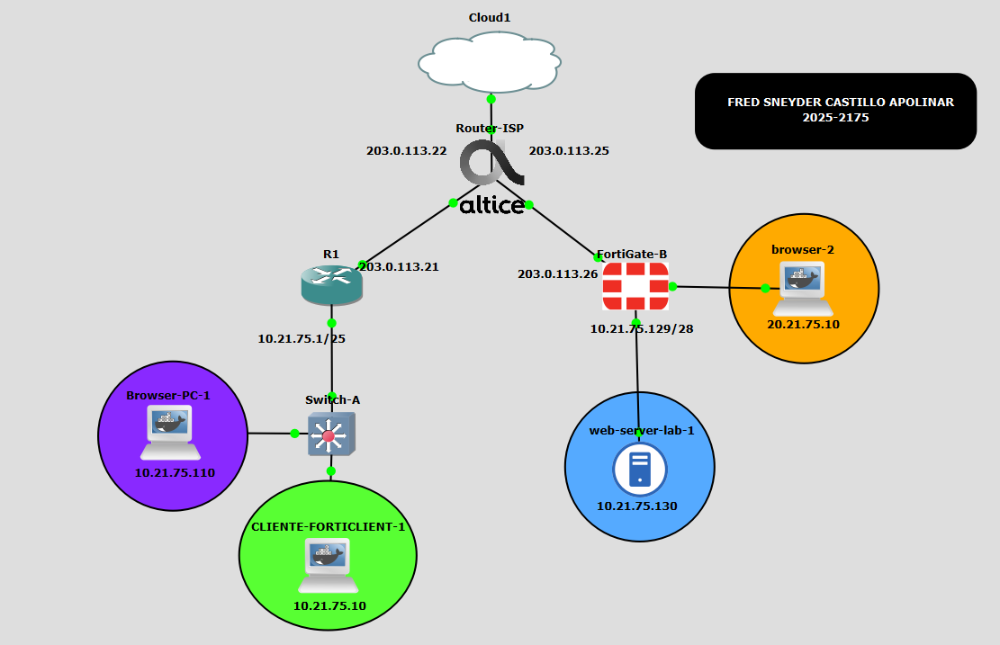
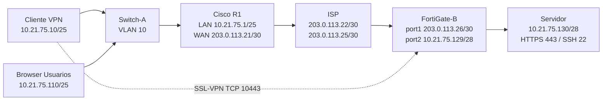
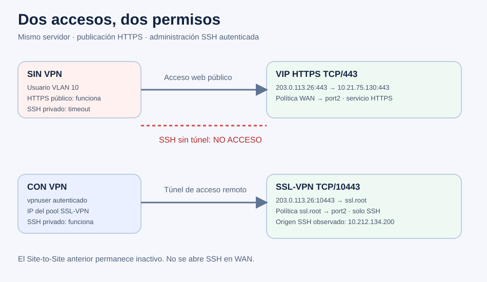

<h1 align="center">🔐 HTTPS Público y SSH mediante SSL-VPN — GNS3</h1>

<p align="center">
  <a href="https://github.com/fredcastillo/https-ssh-ssl-vpn"></a>
  <a href="https://github.com/fredcastillo/https-ssh-ssl-vpn"></a>
  <a href="https://github.com/fredcastillo/https-ssh-ssl-vpn"></a>
  <a href="https://github.com/fredcastillo/https-ssh-ssl-vpn"></a>
  <a href="https://github.com/fredcastillo/https-ssh-ssl-vpn"></a>
  <a href="https://github.com/fredcastillo/https-ssh-ssl-vpn"></a>
</p>

## 🎬 Video demostrativo — 

<div align="center">
  <a href="https://www.youtube.com/watch?v=j-0CpvajZGw">
    
  </a>
</div>

## Propósito del laboratorio

Demostrar que un usuario de la VLAN 10 puede consultar un servidor web por HTTPS sin conectar una VPN, mientras que el acceso administrativo por SSH requiere autenticación y un túnel SSL-VPN de acceso remoto al FortiGate. La práctica separa el servicio público del acceso privado al servidor y aplica permisos por servicio y destino.

El laboratorio se ejecuta en GNS3. La GNS3 VM hospeda FortiGate, Switch-A y los contenedores. Los routers Cisco del escenario se ejecutan en un compute externo. La dirección de administración de la VM no forma parte del tráfico simulado.





## Resultado verificado

| Escenario | Origen de la prueba | Resultado real |
|---|---|---|
| HTTPS sin VPN | Browser-PC-1, red Usuarios | `https://203.0.113.26` devuelve HTTP 200 |
| SSH privado sin VPN | Browser-PC-1, red Usuarios | TCP/22 a 10.21.75.130 agota el tiempo de espera |
| SSL-VPN conectada | CLIENTE-FORTICLIENT | ppp0 recibe **10.212.134.200** |
| Sesión activa | GUI del FortiGate | vpnuser, un túnel y un usuario activo |
| SSH con VPN | CLIENTE-FORTICLIENT | acceso correcto como labssh |
| Origen observado en el servidor | `echo "$SSH_CONNECTION"` | **10.212.134.200** → 10.21.75.130:22 |
| Traceroute TCP/22 con VPN | CLIENTE-FORTICLIENT | alcanza 10.21.75.130; primer salto no responde |


Los archivos JSON de [evidencias](evidence/README.md) contienen los resultados y sus fechas. La prueba negativa previa fue una conexión TCP desde el Browser, no una sesión SSH autenticada. El guion utiliza `ssh` desde el cliente para repetir esa comparación en el video.



## Implementación y límites observados

El nodo conserva el nombre **CLIENTE-FORTICLIENT**, pero el túnel funcional utiliza **openfortivpn 1.17.1**. Se instaló FortiClient VPN-only oficial 7.4.3.5411 para resolver el bloqueo de trial del cliente completo. Ese cliente falló con una alerta de versión TLS. Solo después se diagnosticó el endpoint, que en esta instancia aceptó TLS 1.0. openfortivpn conectó legítimamente con esa compatibilidad y la huella del certificado fijada en su configuración.

La práctica verifica control de acceso y segmentación en un entorno aislado. TLS 1.0, el certificado de laboratorio y las credenciales de práctica son limitaciones del entorno; este repositorio no los presenta como una configuración de producción. No se modificaron licencias, fechas ni binarios.

No se cambió el direccionamiento permanente, Cisco, el VIP HTTPS ni las políticas del FortiGate durante la recuperación. El Site-to-Site anterior permaneció inactivo. Se restauró OpenSSH en el servidor y su inicio junto a Apache. Se guardaron imágenes corregidas conservando los originales.

## Requisitos académicos

| Requisito | Implementación | Documento / evidencia |
|---|---|---|
| FortiGate y red | port1 WAN, port2 servidor, port5 administración auxiliar | [FortiGate por GUI](docs/FORTIGATE-GUI.md), [exports](configs/README.md) |
| Remote Access / Client-to-Site | SSL-VPN TCP/10443, usuario vpnuser, grupo SSLVPN_USERS | [VPN y decisiones](docs/VPN.md), captura GUI |
| Equipo de red preferiblemente Cisco | R1-CISCO-VPN y Switch-A | [Red y direccionamiento](docs/RED.md), configs Cisco/switch |
| ISP y direcciones públicas simuladas | dos enlaces /30 con 203.0.113.0/24 | [Red](docs/RED.md) |
| Servidor /28, HTTPS y SSH | 10.21.75.130/28, Apache y OpenSSH | [Servidor](docs/SERVIDOR.md), [configuración real](configs/server/) |
| Usuarios /25, VLAN 10, DHCP | 10.21.75.0/25; gateway 10.21.75.1; cliente DHCP | [Red](docs/RED.md), configuración de cliente y switch |
| HTTPS sin VPN / SSH con VPN | VIP solo HTTPS, política ssl.root → port2 solo SSH | [Validación](docs/VALIDACION.md), [evidencias](evidence/README.md) |
| Imágenes, diagramas, scripts y running-config | incluidos con procedencia y redacción de secretos | [Inventario](inventory/README.md), [scripts](scripts/README.md), [configs](configs/README.md) |

Las direcciones 203.0.113.0/24 representan Internet dentro del laboratorio y pertenecen a TEST-NET-3 para documentación; no son direcciones públicas enrutables en Internet. [Registro IANA](https://www.iana.org/assignments/iana-ipv4-special-registry/iana-ipv4-special-registry.xhtml).

## Navegación

- [Red, subredes, VLAN, DHCP y NAT](docs/RED.md)
- [Configuración y demostración del FortiGate por GUI](docs/FORTIGATE-GUI.md)
- [Cliente VPN y resolución del problema de compatibilidad](docs/VPN.md)
- [Servidor HTTPS/SSH](docs/SERVIDOR.md)
- [Pruebas reproducibles](docs/VALIDACION.md)
- [Recuperación, imágenes y reproducción](docs/OPERACION.md)
- [Running-config y archivos exportados](configs/README.md)
- [Todos los scripts y su procedencia](scripts/README.md)
- [Guion de la demostración](video/GUION-5m40s.md)
- [Subir la carpeta a GitHub y añadir el video](docs/PUBLICACION.md)

## Estructura

```text
assets/       Imágenes reales y diagramas SVG/Mermaid
configs/      Exports de configuración sanitizados y estado de nodos
docs/         Explicación técnica, operación y publicación
evidence/     Resultados de pruebas y capturas de estado
inventory/    Nodos, versiones, hashes y procedencia
scripts/      Scripts originales, operación y generación documental
video/        Guion cronometrado y preparación
.github/      Verificación documental al publicar en GitHub
```

## 👨‍💻 Autor

**Fred Castillo**  
*Estudiante de Tecnólogo en Seguridad Informática*  
*Aspirante a Red Team | Seguridad Ofensiva*

[](https://www.linkedin.com/in/fredcastillo11/)
[](https://github.com/fredcastillo)

---
