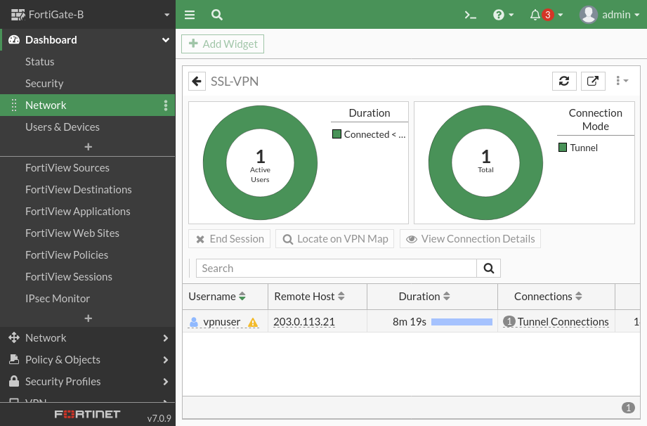
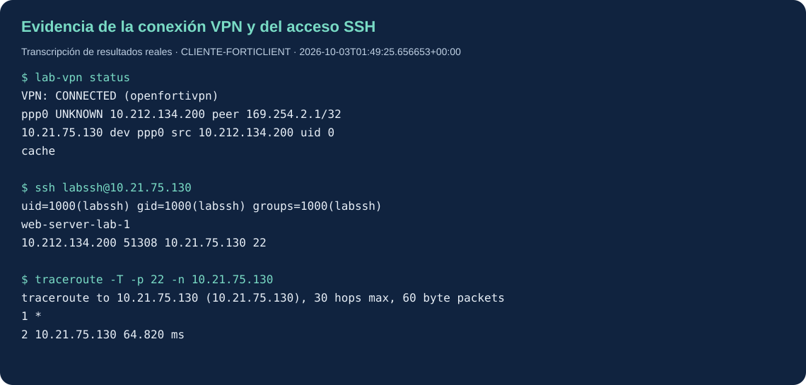

# Evidencias reales

| Archivo | Qué demuestra |
|---|---|
| [without-vpn-final.json](without-vpn-final.json) | Browser Users sin VPN: HTTPS HTTP 200 y timeout TCP/22 privado |
| [with-vpn-final.json](with-vpn-final.json) | túnel activo, IP del pool, SSH autenticado y traceroute TCP/22 |
| [vpn-status-current.txt](vpn-status-current.txt) | comprobación de túnel activo al exportar los nodos |
| [vpn-endpoint-tls.json](vpn-endpoint-tls.json) | protocolo/cipher aceptado y huella del endpoint observados después del fallo FortiClient |
| [r1-diagnostics.txt](r1-diagnostics.txt) | concesión DHCP, interfaces y ausencia de SAs IPsec activas |
| [isp-diagnostics.txt](isp-diagnostics.txt) | tabla de rutas e interfaces del ISP |
| [switch-diagnostics.txt](switch-diagnostics.txt) | VLAN 10 y puertos de acceso conectados |

La imagen SVG de terminal es una transcripción generada a partir del JSON real, no una captura de pantalla de una terminal. Los diagramas representan la topología documentada, no resultados de una prueba. La imagen PNG del monitor sí es una captura real del FortiGate.

Las pruebas se realizaron desde namespaces/nodos de Usuarios. Los timestamps pertenecen a la hora UTC del host. La captura del FortiGate muestra su reloj propio, que no se modificó. Los resultados históricos no reemplazan una nueva sesión grabada en vivo.
